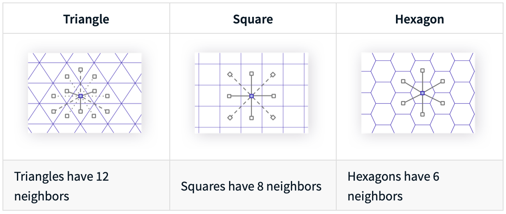
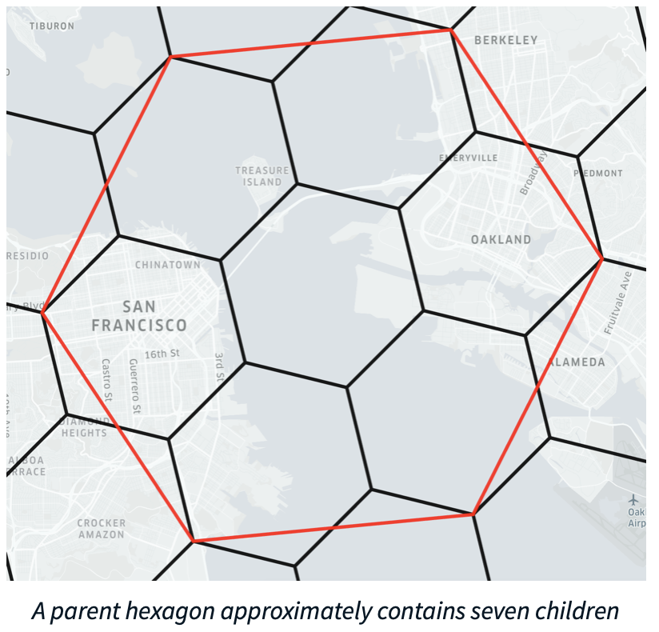
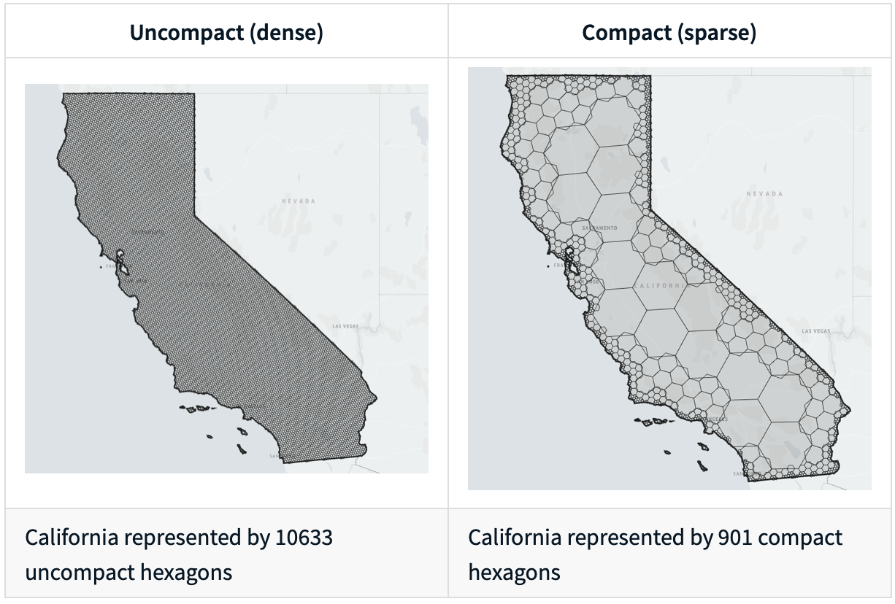
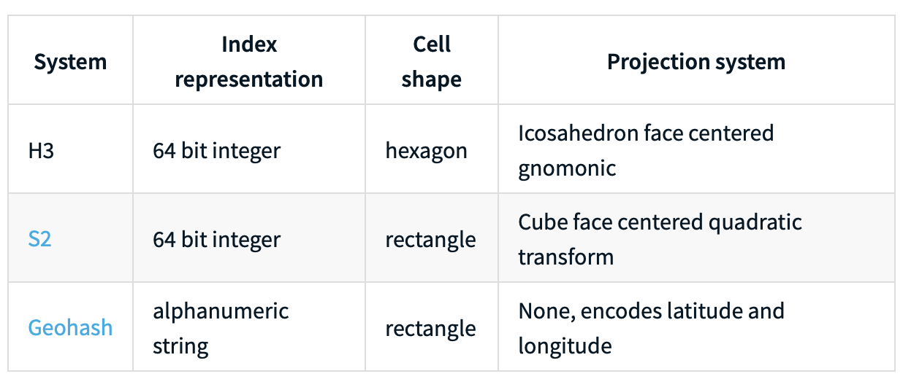

# Introduction

A hexagonal hierarchical geospatial indexing system.
[Repo](https://github.com/uber/h3-py) for h3-py.

## Installation

You need to have `cc`, `make`, `cmake` (version 3.1 or above), and `git` in your `$PATH` when installing this package:

```bash
which cc
/usr/bin/cc
which make
/usr/bin/make
which cmake
/usr/bin/cmake
which git
/usr/bin/git
```

```bash
pip install h3
```

## About

* Indexing coordinates into hexagonal, global grid.
* Hierarchical grid system - Easy, bitwise truncation to coarser, approximate cells, along with area compression/decompression algorithms.
* Entire world is accessible down to square meter resolution.

## H3 Core

* Major library entry points (defined in `h3api.h`) provide the following functionality:
  * given a latitude/longitude point, find the index of the containing H3 cell at a particular resolution
  * given an H3 index, find the latitude/longitude cell center
  * given an H3 index, determine the cell boundary in latitude/longitude coordinates
* The H3 Core Library is written entirely in **C**.

## Why hexagons?

According to [Sahr et al., 2003](resources/gdggs03.pdf)

* most compact
* quantize the plane with smallest average error
* provide greatest angular resolution
* uniform adjacency:
  * six neighbors
  * all of which share an edge with it
  * no neighbors with which it shares only a vertex

But,

* impossible to completely tile a sphere with hexagons
* impossible to decompose a hexagon into smaller hexagons

## Use cases

* There are only three polygons that tile regularly:
  1. the triangle,
  2. the square, and
  3. the hexagon
* Of these, triangles and squares have neighbors with different distances
* Triangles have three different distances, and squares have two different distances
* For hexagons, all neighbors are equidistant. This property allows for simpler analysis of movement

<p align="center">

</p>

* `k_ring(h3_address, ring_size)`: Hexagons have the property of expanding rings of neighbors approximating circles:

<p align="center">

</p>

* `h3_to_parent(h3_address, res)`: Returns the parent (coarser) index containing h.
* `h3_to_children(h3_address, res)`: Populates `children` with the indexes contained by `h3_address` at resolution `res`.

<p align="center">

</p>

* `uncompact(h3_address, res)`: Uncompacts the set `h3_address` of indexes to the resolution `res`, into a `compacted_hex_set`.
* `compact(h3_addresses)`: Compacts the set `h3_addresses` of indexes as best as possible, into a  `compacted_hex_set`.

<p align="center">

</p>

## Comparisons

<p align="center">

</p>