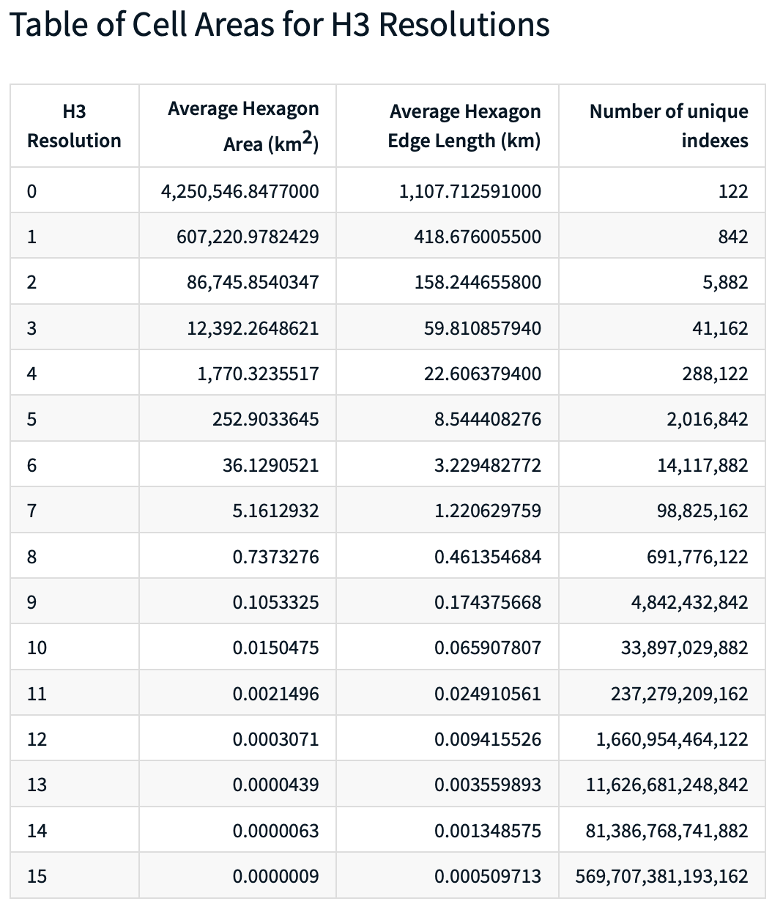

# Overview

* H3 is a discrete global grid system
* multi-precision hexagonal tiling of the sphere with hierarchical indexes
* grid system is created on the planar faces of a sphere-circumscribed icosahedron1
* grid cells are then projected to the surface of the sphere using an inverse face-centered polyhedral gnomonic projection2

* H3 grid is constructed on the icosahedron by recursively creating increasingly higher precision hexagon grids until the desired resolution is achieved
* impossible to tile the sphere/icosahedron completely with hexagons
* each resolution of an icosahedral hexagon grid must contain exactly 12 pentagons at every resolution, with one pentagon centered on each of the icosahedron vertices.

## Defintions
1. A polyhedron with 20 faces [Wikipedia](https://en.wikipedia.org/wiki/Icosahedron)
2. A gnomonic map projection displays all great circles as straight lines, resulting in any straight line segment on a gnomonic map showing a geodesic, the shortest route between the segment's two endpoints. [Wikipedia](https://en.wikipedia.org/wiki/Gnomonic_projection)