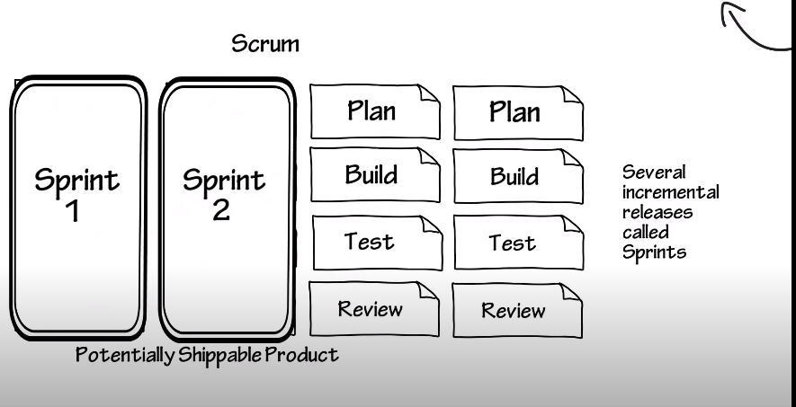

# What is scrum

* Agile project management framework
* Scrum is a framework for getting work done
* While agile is a set of values and principles
* Scrum $\neq$ Agile
* A product is built in sprints (series of iterations)
* Short iterations (sprints) - reduces risk and costs
* Milestones - end of sprint
* Embraces change unlike waterfall

  

* 3 Roles:
  * Product owner
  * Scrum master
  * Team - testers, developers, writers, etc.
* 3 Artificats/documents:
  * Product Backlog
    * User Stories - "As a user I need ... so that ..."
  * Spring backlog - highest priority user stories
  * burndown chart - progress for sprints
* 3 Ceremonies:
  * Sprint planning
  * Daily scrum
  * Sprint review - retrospective

## References
1. [Atlassian - What is Scrum?](https://www.atlassian.com/agile/scrum)
2. [Introduction to Scrum - 7 Minutes](https://www.youtube.com/watch?v=9TycLR0TqFA)